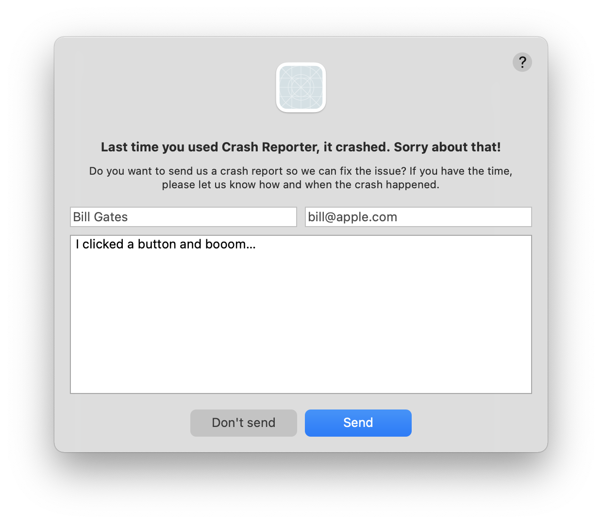

# CrashReporterAC

[](https://travis-ci.org/Iomegan/CrashReporterAC)
[](https://cocoapods.org/pods/CrashReporterAC)
[](https://cocoapods.org/pods/CrashReporterAC)
[](https://cocoapods.org/pods/CrashReporterAC)

## Description
A bug report contains device logs, stack traces, and other diagnostic information to help you find and fix bugs in your app. It should also include user feedback that helps you to reproduce the issue. Unfortunately that's not part of [Microsoft' AppCenter](https://appcenter.ms/apps)  implementation for macOS. However there are APIs that allow you to send text attachments with each crash. CrashReporterAC asks the user for feedback and submits it with the crash details to AppCenter.

## Screenshot



## Example

To run the example project, clone the repo, and run `pod install` from the Example directory first.

## Requirements

- macOS 10.10
- [Microsoft AppCenter](https://appcenter.ms/apps) 

## Installation

CrashReporterAC is available through [CocoaPods](https://cocoapods.org). To install
it, simply add the following line to your Podfile:

```ruby
pod 'CrashReporterAC'
```

Add this to your AppDelegate:
```
private let crashReporterAC = CrashReporterAC(helpURL: URL(string: "https://example.com/privacy/#app-center"))
```

Make sure to add the following **before** calling `MSAppCenter.start()`, usually in `applicationDidFinishLaunching(_:)`:


```swift
MSCrashes.setDelegate(self)
let crashReporterAC = CrashReporterAC(helpURL: URL(string: "https://example.com/privacy/#app-center"))
MSCrashes.setUserConfirmationHandler(crashReporterAC.userConfirmationHandler)
```

Also implement the delegates:


```swift
// MARK: - MSCrashesDelegate
    
func attachments(with crashes: MSCrashes, for errorReport: MSErrorReport) -> [MSErrorAttachmentLog] {
    guard crashReporterAC.crashUserProvidedDescription != nil else {
        return []
    }

    let attachment1 = MSErrorAttachmentLog.attachment(withText: crashReporterAC.crashUserProvidedDescription!, filename: "UserProvidedDescription.txt")
    return [attachment1! 
}
    
func crashes(_ crashes: MSCrashes!, didFailSending errorReport: MSErrorReport!, withError error: Error!) {
    crashReporterAC.crashUserProvidedDescription = nil 
}
    
func crashes(_ crashes: MSCrashes!, didSucceedSending errorReport: MSErrorReport!) {
    crashReporterAC.crashUserProvidedDescription = nil
}
```

## Author

Daniel Witt, info@witt-software.com

## License

CrashReporterAC is available under the MIT license. See the LICENSE file for more info.
